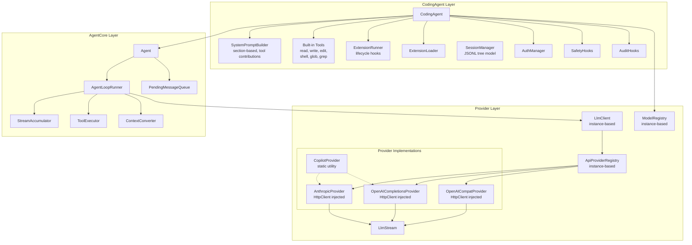

# Architecture Overview

BotNexus is a modular AI agent execution platform built in C#/.NET. It provides a layered architecture where providers handle LLM communication, a core agent loop orchestrates tool-calling turns, and a coding agent layer wires everything together into a working coding assistant.

## Project Map

The source is organized into three layers, each a separate .NET project:

| Project | Path | Role |
|---------|------|------|
| **Providers.Core** | `src/providers/BotNexus.Providers.Core/` | Provider contracts, model registry, streaming primitives, LlmClient |
| **Providers.Anthropic** | `src/providers/BotNexus.Providers.Anthropic/` | Anthropic Messages API provider |
| **Providers.OpenAI** | `src/providers/BotNexus.Providers.OpenAI/` | OpenAI Chat Completions API provider |
| **Providers.Copilot** | `src/providers/BotNexus.Providers.Copilot/` | GitHub Copilot provider with OAuth |
| **Providers.OpenAICompat** | `src/providers/BotNexus.Providers.OpenAICompat/` | OpenAI-compatible endpoint provider (Groq, xAI, etc.) |
| **AgentCore** | `src/agent/BotNexus.AgentCore/` | Agent loop, tool execution, event system, message types |
| **CodingAgent** | `src/coding-agent/BotNexus.CodingAgent/` | Built-in tools, system prompt, session management, CLI |

## High-Level Architecture

## How the Layers Connect

### 1. Provider Layer (bottom)

The provider layer handles all communication with LLM APIs. It defines:

- **`IApiProvider`** — the contract every provider implements (`Stream`, `StreamSimple`)
- **`ApiProviderRegistry`** — instance-based, thread-safe registry mapping API format names to provider instances
- **`ModelRegistry`** — instance-based registry mapping `(provider, modelId)` pairs to `LlmModel` definitions
- **`LlmClient`** — instance-based entry point (takes registries via constructor) that resolves a provider and delegates streaming
- **`LlmStream`** — channel-based `IAsyncEnumerable<AssistantMessageEvent>` primitive

Each provider (Anthropic, OpenAI, OpenAICompat) translates the common `Context` model into its API format, makes HTTP requests, parses SSE responses, and pushes events into an `LlmStream`. Providers accept `HttpClient` via constructor injection. `CopilotProvider` is a static utility class that provides auth helpers for Copilot routing through the standard providers.

> **Deep dive:** [Provider System](01-provider-system.md) · [Streaming](02-streaming.md)

### 2. AgentCore Layer (middle)

The agent core implements the orchestration loop:

- **`Agent`** — stateful wrapper that owns the message timeline, enforces single-run concurrency, and exposes `PromptAsync` / `ContinueAsync` / `Steer` / `FollowUp` APIs
- **`AgentLoopRunner`** — the core turn loop: drain steering → call LLM → execute tools → repeat
- **`StreamAccumulator`** — consumes `LlmStream` events and emits `AgentEvent`s
- **`ToolExecutor`** — runs tool calls in sequential or parallel mode with before/after hooks
- **`ContextConverter`** — transforms `AgentMessage[]` to provider `Message[]` at the LLM call boundary

> **Deep dive:** [Agent Loop](03-agent-loop.md) · [Tool Execution](04-tool-execution.md)

### 3. CodingAgent Layer (top)

The coding agent layer assembles a working coding assistant:

- **`CodingAgent.CreateAsync`** — wires providers, tools, hooks, auth, and system prompt into an `Agent`
- **Built-in tools** — `ReadTool`, `WriteTool`, `EditTool`, `ShellTool`, `GlobTool`, `GrepTool`
- **`SystemPromptBuilder`** — section-based prompt builder with tool contributions and context files
- **`SafetyHooks`** / `AuditHooks` — enforce path blocking, command restrictions, and audit logging
- **`ExtensionLoader`** / `ExtensionRunner` — dynamic tool loading and extension lifecycle management (session/tool/compaction/model hooks)
- **`SessionManager`** — JSONL-based session persistence with tree branching support

> **Deep dive:** [CodingAgent Layer](05-coding-agent.md) · [Building Your Own](06-building-your-own.md)

## Data Flow Summary

A typical request flows through all three layers:

1. User calls `agent.PromptAsync("Fix the bug in auth.cs")`
2. `Agent` appends the message to its timeline, acquires the run lock
3. `AgentLoopRunner` drains steering messages, converts the timeline via `ContextConverter`
4. `LlmClient.StreamSimple()` resolves the provider and starts streaming
5. Provider makes an HTTP request, parses SSE, pushes events into `LlmStream`
6. `StreamAccumulator` converts stream events to `AgentEvent`s (MessageStart → MessageUpdate → MessageEnd)
7. If the assistant requests tool calls, `ToolExecutor` runs them with hooks
8. Tool results are appended to the timeline, and the loop continues
9. When no more tool calls are needed, `AgentEndEvent` fires and the run completes

## Next Steps

- [Provider System →](01-provider-system.md) — understand how LLM providers work
- [Agent Loop →](03-agent-loop.md) — understand the core orchestration loop
- [Building Your Own →](06-building-your-own.md) — build a custom agent from scratch
