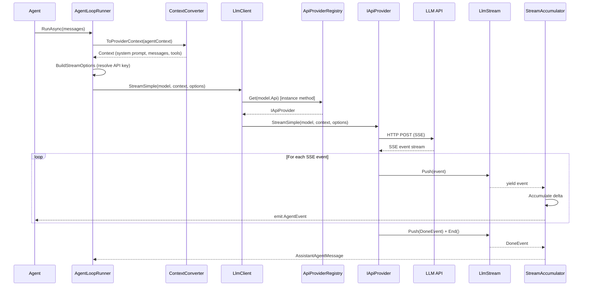
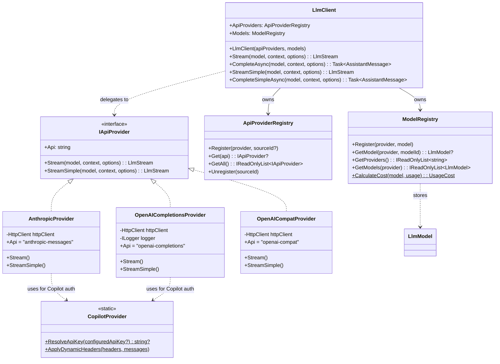

# Provider System

The provider system is the communication layer between BotNexus and LLM APIs. It defines how models are registered, how API keys are resolved, and how requests are routed to the correct provider implementation.

## Core Concepts

### IApiProvider — The Provider Contract

Every LLM provider implements `IApiProvider`, which defines three things:

```csharp
// BotNexus.Providers.Core.Registry.IApiProvider
public interface IApiProvider
{
    // Unique API format identifier (e.g., "anthropic-messages", "openai-completions")
    string Api { get; }

    // Full streaming with all options
    LlmStream Stream(LlmModel model, Context context, StreamOptions? options = null);

    // Simplified streaming with reasoning/thinking support
    LlmStream StreamSimple(LlmModel model, Context context, SimpleStreamOptions? options = null);
}
```

Each provider handles a specific API format. All providers accept an `HttpClient` via constructor injection:

| Provider | `Api` Value | Constructor | Handles |
|----------|-------------|-------------|---------|
| `AnthropicProvider` | `"anthropic-messages"` | `(HttpClient)` | Anthropic Messages API |
| `OpenAICompletionsProvider` | `"openai-completions"` | `(HttpClient, ILogger)` | OpenAI Chat Completions API |
| `OpenAICompatProvider` | `"openai-compat"` | `(HttpClient)` | Any OpenAI-compatible endpoint |
| `CopilotProvider` | *(static utility)* | — | Helper for GitHub Copilot auth and headers |

> **Note:** `CopilotProvider` is no longer an `IApiProvider` implementation. It is a static utility class that provides `ResolveApiKey()` and `ApplyDynamicHeaders()` helpers. Copilot requests are routed through the standard `OpenAICompletionsProvider` (or `AnthropicProvider` for Claude models on Copilot), which call into `CopilotProvider` for auth header injection.

### LlmModel — Model Definitions

Every model the system can use is described by an `LlmModel` record:

```csharp
// BotNexus.Providers.Core.Models.LlmModel
public record LlmModel(
    string Id,               // Model identifier (e.g., "gpt-4.1")
    string Name,             // Display name
    string Api,              // API format (routes to provider)
    string Provider,         // Provider identifier (e.g., "github-copilot")
    string BaseUrl,          // API endpoint base URL
    bool Reasoning,          // Supports extended reasoning
    IReadOnlyList<string> Input,  // Input modalities ("text", "image")
    ModelCost Cost,          // Per-million-token pricing
    int ContextWindow,       // Max context tokens
    int MaxTokens,           // Max output tokens
    IReadOnlyDictionary<string, string>? Headers = null,  // Custom HTTP headers
    OpenAICompletionsCompat? Compat = null  // Compatibility flags
);
```

The `Api` field is the routing key — it determines which `IApiProvider` handles requests for this model.

### ModelRegistry — Where Models Live

`ModelRegistry` is an **instance-based**, thread-safe registry backed by `ConcurrentDictionary<provider, ConcurrentDictionary<modelId, LlmModel>>`:

```csharp
// Create an instance (typically one per application)
var modelRegistry = new ModelRegistry();

// Register a model
modelRegistry.Register("github-copilot", myModel);

// Look up a model
LlmModel? model = modelRegistry.GetModel("github-copilot", "gpt-4.1");

// List all providers
IReadOnlyList<string> providers = modelRegistry.GetProviders();

// List all models for a provider
IReadOnlyList<LlmModel> models = modelRegistry.GetModels("github-copilot");
```

Models are registered at startup. Built-in models are defined in `BuiltInModels.cs`, and extensions can register additional models at runtime.

### ApiProviderRegistry — Provider Registration

`ApiProviderRegistry` is an **instance-based** registry mapping API format strings to `IApiProvider` instances:

```csharp
// Create an instance (typically one per application)
var apiProviderRegistry = new ApiProviderRegistry();

// Register a provider (HttpClient is constructor-injected into providers)
var httpClient = new HttpClient();
apiProviderRegistry.Register(new AnthropicProvider(httpClient), sourceId: "built-in");

// Look up a provider
IApiProvider? provider = apiProviderRegistry.Get("anthropic-messages");

// Unregister all providers from a source
apiProviderRegistry.Unregister("my-extension");
```

The `sourceId` parameter supports extension cleanup — when an extension is unloaded, all its providers can be removed in one call.

## LlmClient — The Entry Point

`LlmClient` is an **instance-based** entry point that ties the registries together. It takes `ApiProviderRegistry` and `ModelRegistry` as constructor dependencies:

```csharp
public sealed class LlmClient
{
    public ApiProviderRegistry ApiProviders { get; }
    public ModelRegistry Models { get; }

    public LlmClient(ApiProviderRegistry apiProviderRegistry, ModelRegistry modelRegistry);

    // Streaming with full options
    public LlmStream Stream(LlmModel model, Context context, StreamOptions? options = null);

    // Non-streaming convenience (awaits the full response)
    public async Task<AssistantMessage> CompleteAsync(
        LlmModel model, Context context, StreamOptions? options = null);

    // Streaming with SimpleStreamOptions (supports reasoning)
    public LlmStream StreamSimple(LlmModel model, Context context, SimpleStreamOptions? options = null);

    // Non-streaming with SimpleStreamOptions
    public async Task<AssistantMessage> CompleteSimpleAsync(
        LlmModel model, Context context, SimpleStreamOptions? options = null);
}
```

Internally, `LlmClient` resolves the provider from `model.Api` via its injected registry:

```csharp
private IApiProvider ResolveProvider(string api)
{
    return ApiProviders.Get(api)
           ?? throw new InvalidOperationException($"No API provider registered for api: {api}");
}
```

## Request Context

Every LLM request is described by a `Context` record:

```csharp
public record Context(
    string? SystemPrompt,              // System message
    IReadOnlyList<Message> Messages,   // Conversation history
    IReadOnlyList<Tool>? Tools = null  // Available tools (JSON schema)
);
```

Messages use polymorphic serialization with a `role` discriminator:

```csharp
public abstract record Message(long Timestamp);
public sealed record UserMessage(UserMessageContent Content, long Timestamp) : Message(Timestamp);
public sealed record AssistantMessage(...) : Message(Timestamp);
public sealed record ToolResultMessage(string ToolCallId, string ToolName, ...) : Message(Timestamp);
```

## API Key Resolution

API keys are resolved through two mechanisms:

### 1. Environment Variables (EnvironmentApiKeys)

```csharp
// Maps provider identifiers to environment variables
"openai"         → OPENAI_API_KEY
"anthropic"      → ANTHROPIC_OAUTH_TOKEN ?? ANTHROPIC_API_KEY
"github-copilot" → COPILOT_GITHUB_TOKEN ?? GH_TOKEN ?? GITHUB_TOKEN
"groq"           → GROQ_API_KEY
// ... etc
```

### 2. Runtime GetApiKey Delegate

The agent loop calls a `GetApiKeyDelegate` before each LLM invocation, allowing runtime resolution (OAuth refresh, config file reads, etc.):

```csharp
public delegate Task<string?> GetApiKeyDelegate(string provider, CancellationToken cancellationToken);
```

## Stream Options

Two option records control generation behavior. Both use `init`-only properties for immutability:

```csharp
public record class StreamOptions
{
    public float? Temperature { get; init; }
    public int? MaxTokens { get; init; }
    public CancellationToken CancellationToken { get; init; }
    public string? ApiKey { get; init; }
    public Transport Transport { get; init; } = Transport.Sse;
    public CacheRetention CacheRetention { get; init; } = CacheRetention.Short;
    public string? SessionId { get; init; }
    public Func<object, LlmModel, Task<object?>>? OnPayload { get; init; }
    public Dictionary<string, string>? Headers { get; init; }
    public int MaxRetryDelayMs { get; init; } = 60000;
    public Dictionary<string, object>? Metadata { get; init; }
}

public record class SimpleStreamOptions : StreamOptions
{
    public ThinkingLevel? Reasoning { get; init; }
    public ThinkingBudgets? ThinkingBudgets { get; init; }
}
```

The `OnPayload` hook lets extensions intercept and transform the raw API payload before it's sent. The agent loop uses `SimpleStreamOptions` to support reasoning/thinking models.

## Full Request Flow



## Provider Class Hierarchy



## Next Steps

- [Streaming →](02-streaming.md) — how SSE parsing and the event pipeline work
- [Agent Loop →](03-agent-loop.md) — how the agent loop uses providers
- [Architecture Overview](00-overview.md) — back to the big picture
