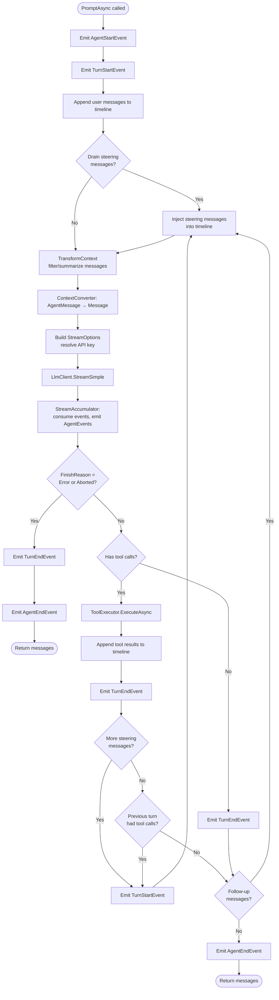
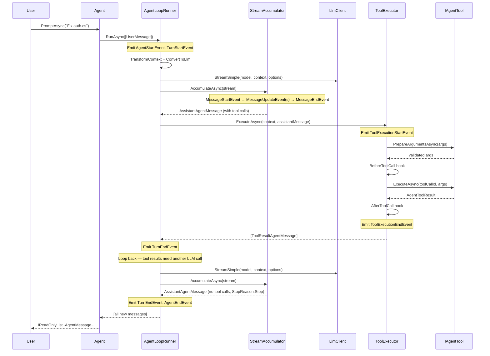

# Agent Loop

The agent loop is the core orchestration engine of BotNexus. It manages the cycle of calling the LLM, executing tool calls, and feeding results back until the model is done. This document explains the `Agent` class, `AgentLoopRunner`, and every decision point in the loop.

## Agent — The Stateful Wrapper

`Agent` is the top-level class that application code interacts with. It owns the conversation timeline, enforces single-run concurrency, and exposes queueing APIs.

### Lifecycle: Create → Run → Complete

```csharp
// 1. Create with options
var agent = new Agent(options);

// 2. Subscribe to events (optional)
using var sub = agent.Subscribe(async (evt, ct) =>
{
    if (evt is MessageUpdateEvent update)
        Console.Write(update.ContentDelta);
});

// 3. Run with a prompt
var result = await agent.PromptAsync("Fix the bug in auth.cs");

// 4. Access the final messages
var lastMessage = result[^1] as AssistantAgentMessage;
```

### Key Properties and Methods

```csharp
public sealed class Agent
{
    // Current state (system prompt, model, tools, messages)
    public AgentState State { get; }

    // Execution status: Idle, Running, or Aborting
    public AgentStatus Status { get; }

    // Subscribe to lifecycle events
    public IDisposable Subscribe(Func<AgentEvent, CancellationToken, Task> listener);

    // Start a new run
    public Task<IReadOnlyList<AgentMessage>> PromptAsync(string text, CancellationToken ct = default);
    public Task<IReadOnlyList<AgentMessage>> PromptAsync(AgentMessage message, CancellationToken ct = default);
    public Task<IReadOnlyList<AgentMessage>> PromptAsync(IReadOnlyList<AgentMessage> messages, CancellationToken ct = default);

    // Continue without new input (retry with existing context)
    public Task<IReadOnlyList<AgentMessage>> ContinueAsync(CancellationToken ct = default);

    // Inject messages at turn boundaries
    public void Steer(AgentMessage message);       // Before next LLM call
    public void FollowUp(AgentMessage message);    // After current run completes

    // Cancel the current run
    public Task AbortAsync();
}
```

### AgentState

The agent's mutable state is exposed via `State`:

```csharp
public class AgentState
{
    public string? SystemPrompt { get; set; }
    public LlmModel Model { get; set; }
    public ThinkingLevel? ThinkingLevel { get; set; }
    public IReadOnlyList<IAgentTool> Tools { get; set; }
    public IReadOnlyList<AgentMessage> Messages { get; set; }

    // Read-only runtime state
    public bool IsStreaming { get; }
    public AssistantAgentMessage? StreamingMessage { get; }
    public IReadOnlySet<string> PendingToolCalls { get; }
    public string? ErrorMessage { get; }
}
```

State changes (e.g., swapping tools or models) take effect on the next `PromptAsync` call — they don't affect in-flight runs.

## AgentOptions — Configuration

The agent is configured at construction time via `AgentOptions`:

```csharp
public record AgentOptions(
    AgentInitialState? InitialState,       // Seed state (prompt, model, tools, messages)
    LlmModel Model,                        // Default model
    ConvertToLlmDelegate ConvertToLlm,     // AgentMessage[] → provider Message[]
    TransformContextDelegate TransformContext,  // Pre-LLM message filtering
    GetApiKeyDelegate GetApiKey,           // Runtime API key resolution
    GetMessagesDelegate? GetSteeringMessages,  // Turn-boundary message injection
    GetMessagesDelegate? GetFollowUpMessages,  // Post-run message injection
    ToolExecutionMode ToolExecutionMode,   // Sequential or Parallel
    BeforeToolCallDelegate? BeforeToolCall,    // Pre-execution hook
    AfterToolCallDelegate? AfterToolCall,      // Post-execution hook
    SimpleStreamOptions GenerationSettings,    // Temperature, maxTokens, etc.
    QueueMode SteeringMode,                // All or OneAtATime
    QueueMode FollowUpMode,                // All or OneAtATime
    string? SessionId = null);
```

## AgentLoopRunner — Step by Step

`AgentLoopRunner` is the static class that implements the core turn loop. It's the engine inside `Agent.PromptAsync`.

### The Full Agent Loop



### Loop Phases in Detail

**Phase 1: Setup**
```
PromptAsync(messages) → RunAsync(prompts, context, config, emit, ct)
```
- Appends user messages to the timeline
- Emits `AgentStartEvent` and `TurnStartEvent`

**Phase 2: Steering**
- Drains `GetSteeringMessages` delegate and the internal steering queue
- Injects any queued messages into the timeline

**Phase 3: LLM Call**
- `TransformContext` filters/summarizes messages
- `ContextConverter.ToProviderContext()` converts `AgentMessage[]` to `Message[]` and `IAgentTool[]` to `Tool[]`
- API key is resolved via `GetApiKey`
- `LlmClient.StreamSimple()` starts the provider stream

**Phase 4: Accumulation**
- `StreamAccumulator.AccumulateAsync()` consumes the `LlmStream`
- Emits `MessageStartEvent` → `MessageUpdateEvent`(s) → `MessageEndEvent`
- Returns the final `AssistantAgentMessage`

**Phase 5: Tool Execution**
- If `assistantMessage.ToolCalls` is non-empty, `ToolExecutor.ExecuteAsync()` runs them
- Tool results are appended to the timeline

**Phase 6: Decision**
- If more tool calls → loop back to Phase 2
- If steering messages → loop back to Phase 2
- If follow-up messages → loop back to Phase 2
- Otherwise → emit `AgentEndEvent` and return

## Complete Turn Sequence



## Steering and Follow-Up Messages

The agent supports message injection at two points:

### Steering Messages (Turn Boundaries)

Steering messages are injected **before each LLM call**. Use them for:
- User interruptions during a run
- Context updates (e.g., "the file has changed")
- Mid-run corrections

```csharp
// From external code while the agent is running
agent.Steer(new UserMessage("Actually, use the new API instead"));
```

The `QueueMode` controls how many messages are drained per turn:
- `QueueMode.All` — drain all queued messages at once
- `QueueMode.OneAtATime` — drain one message per turn boundary

### Follow-Up Messages (Run Completion)

Follow-up messages are injected **after the main loop settles** (no more tool calls or steering). If follow-ups exist, the loop continues with another cycle.

```csharp
agent.FollowUp(new UserMessage("Now also fix the tests"));
```

## Event System

All events extend `AgentEvent` and carry a `Type` and `Timestamp`:

| Event | When | Key Data |
|-------|------|----------|
| `AgentStartEvent` | Run begins | — |
| `TurnStartEvent` | Before each LLM call | — |
| `MessageStartEvent` | Message processing begins | `Message` |
| `MessageUpdateEvent` | Streaming delta | `ContentDelta`, `IsThinking`, `ToolCallId`, `ArgumentsDelta` |
| `MessageEndEvent` | Message finalized | `Message` |
| `ToolExecutionStartEvent` | Tool about to execute | `ToolCallId`, `ToolName`, `Args` |
| `ToolExecutionUpdateEvent` | Tool progress | `PartialResult` |
| `ToolExecutionEndEvent` | Tool finished | `Result`, `IsError` |
| `TurnEndEvent` | Turn complete | `Message`, `ToolResults` |
| `AgentEndEvent` | Run complete | `Messages` (full timeline) |

Events are emitted via `Subscribe` listeners and awaited in subscription order.

## Abort and Error Handling

### Abort

Calling `agent.AbortAsync()` signals the cancellation token, which:
1. Interrupts the current LLM stream
2. Interrupts any running tool execution
3. Sets `StopReason.Aborted` on the final message
4. Emits `TurnEndEvent` and `AgentEndEvent`

### Error Handling

- **LLM errors**: Provider pushes `ErrorEvent` → accumulator sets `StopReason.Error` → loop exits
- **Tool errors**: Exceptions are caught, converted to error `AgentToolResult`, `IsError=true`
- **Hook errors**: Before/after hook exceptions are logged and ignored
- **Concurrency**: Only one `PromptAsync`/`ContinueAsync` can run at a time (enforced by `SemaphoreSlim`)

## Next Steps

- [Tool Execution →](04-tool-execution.md) — deep dive into how tools work
- [Streaming](02-streaming.md) — how StreamAccumulator works
- [Architecture Overview](00-overview.md) — back to the big picture
