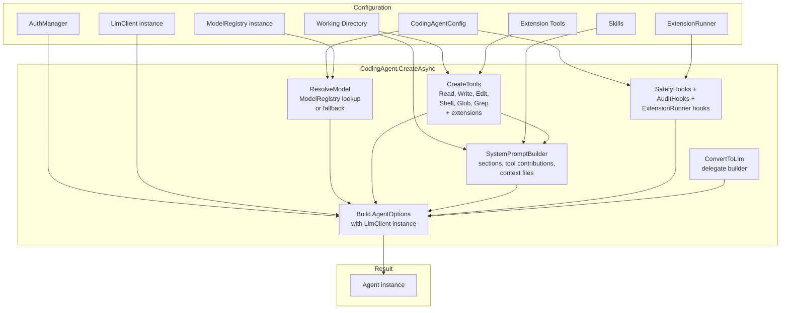
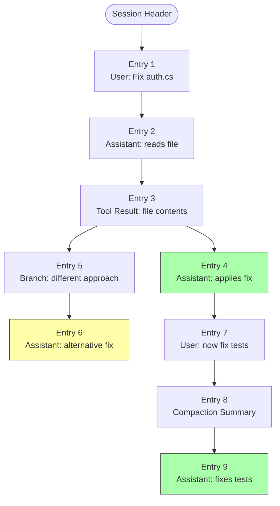

# CodingAgent Layer

The `CodingAgent` layer is where everything comes together. It builds on `AgentCore` to create a fully functional coding assistant with file operations, shell access, safety hooks, and an extension system. This document shows how the pieces connect.

## How CodingAgent Builds on AgentCore

`CodingAgent` is a static factory class. It doesn't subclass `Agent` — it configures and creates one:

```csharp
public static class CodingAgent
{
    public static async Task<Agent> CreateAsync(
        CodingAgentConfig config,
        string workingDirectory,
        AuthManager authManager,
        LlmClient llmClient,
        ModelRegistry modelRegistry,
        ExtensionRunner? extensionRunner = null,
        IReadOnlyList<IAgentTool>? extensionTools = null,
        IReadOnlyList<string>? skills = null);
}
```

Internally, `CreateAsync` does this:

1. **Resolves the working directory** and creates the `.botnexus-agent/` directory structure
2. **Creates built-in tools** scoped to the working directory
3. **Detects environment** — git branch, git status, package manager
4. **Builds the system prompt** via `SystemPromptBuilder` (section-based with tool contributions)
5. **Resolves the model** from config or the injected `ModelRegistry` instance
6. **Creates hooks** — `SafetyHooks`, `AuditHooks`, and extension hooks via `ExtensionRunner`
7. **Assembles `AgentOptions`** with all delegates wired up (including `LlmClient` instance)
8. **Returns a configured `Agent`**

## CodingAgent Composition



## Built-in Tools

The CodingAgent ships with six tools, all scoped to the working directory:

| Tool | Class | Purpose |
|------|-------|---------|
| `read` | `ReadTool` | Read file contents with optional line range |
| `write` | `WriteTool` | Create or overwrite files |
| `edit` | `EditTool` | Make targeted find-and-replace edits |
| `shell` | `ShellTool` | Execute shell commands |
| `glob` | `GlobTool` | Find files matching glob patterns |
| `grep` | `GrepTool` | Search file contents with regex |

Extension tools are appended after the built-in set:

```csharp
private static IReadOnlyList<IAgentTool> CreateTools(
    string workingDirectory, IReadOnlyList<IAgentTool>? extensionTools)
{
    var tools = new List<IAgentTool>
    {
        new ReadTool(workingDirectory),
        new WriteTool(workingDirectory),
        new EditTool(workingDirectory),
        new ShellTool(),
        new GlobTool(workingDirectory),
        new GrepTool(workingDirectory)
    };

    if (extensionTools is { Count: > 0 })
    {
        tools.AddRange(extensionTools);
    }

    return tools;
}
```

## System Prompt Construction

`SystemPromptBuilder` uses a **section-based** architecture with tool contributions. Tools can now contribute their own prompt snippets and guidelines:

```csharp
public sealed record ToolPromptContribution(
    string Name,
    string? Snippet = null,
    IReadOnlyList<string>? Guidelines = null);

public sealed record PromptContextFile(
    string Path,
    string Content);

public sealed record SystemPromptContext(
    string WorkingDirectory,
    string? GitBranch,
    string? GitStatus,
    string PackageManager,
    IReadOnlyList<string> ToolNames,
    IReadOnlyList<string> Skills,
    string? CustomInstructions,
    IReadOnlyList<ToolPromptContribution>? ToolContributions = null,
    IReadOnlyList<PromptContextFile>? ContextFiles = null);
```

The generated prompt is composed of ordered sections:
1. **Role definition** — "You are a coding assistant with access to tools..."
2. **Environment** — OS, working directory, git branch, package manager
3. **Available Tools** — tool names with optional snippets from `ToolPromptContribution`
4. **Tool Guidelines** — merged set from built-in defaults + tool-contributed guidelines
5. **Project Context** — content from `PromptContextFile` entries (e.g., README, CONTRIBUTING)
6. **Skills** — parsed skill files with frontmatter
7. **Custom Instructions** — user-configured instructions

## Configuration

`CodingAgentConfig` supports three-layer configuration merging:

```
Defaults → Global (~/.botnexus/coding-agent.json) → Local (.botnexus-agent/config.json)
```

```csharp
public sealed class CodingAgentConfig
{
    public string? Model { get; set; }            // e.g., "gpt-4.1"
    public string? Provider { get; set; }         // e.g., "github-copilot"
    public string? ApiKey { get; set; }           // Direct API key
    public int MaxToolIterations { get; set; }    // Default: 40
    public int MaxContextTokens { get; set; }     // Default: 100000
    public List<string> AllowedCommands { get; set; }  // Shell command whitelist
    public List<string> BlockedPaths { get; set; }     // File paths to deny
    public Dictionary<string, object?> Custom { get; set; }  // Extension config
}
```

The `Load(workingDirectory)` method handles the merge chain. `EnsureDirectories` creates the local config folder and writes a default `config.json` if missing.

## Safety Hooks

`SafetyHooks` runs as a `BeforeToolCallDelegate` and enforces:

- **Path blocking** — write/edit tools are checked against `BlockedPaths`
- **Command blocking** — shell commands are checked against `AllowedCommands` whitelist and a built-in blocklist (`rm -rf /`, `format`, `del /s /q`)
- **Large write warnings** — payloads over 1MB trigger a console warning

```csharp
public sealed class SafetyHooks
{
    public Task<BeforeToolCallResult?> ValidateAsync(
        BeforeToolCallContext context,
        CodingAgentConfig config);
}
```

## Session Management

The CodingAgent includes session support via `SessionManager`, `SessionInfo`, and `SessionCompactor`:

- Sessions track conversation history across runs using a **JSONL tree model** (see below)
- The compactor manages context window limits with two modes:
  - **Legacy `Compact`** — count-based, keeps N recent messages and heuristically summarizes older ones
  - **Token-aware `CompactAsync`** — estimates token usage, uses LLM-driven summarization when thresholds are exceeded, and falls back to heuristic summaries
- Session data is stored in `.botnexus-agent/sessions/` as `.jsonl` files

### Token-Aware Compaction

`SessionCompactor.CompactAsync` uses structured options to control compaction behavior:

```csharp
public sealed record SessionCompactionOptions(
    int MaxContextTokens = 100000,    // Total context budget
    int ReserveTokens = 16384,        // Reserved for system prompt + response
    int KeepRecentTokens = 20000,     // Minimum recent tokens to preserve
    int KeepRecentCount = 10,         // Minimum recent messages to keep
    LlmClient? LlmClient = null,     // For LLM-driven summarization
    LlmModel? Model = null,          // Summary model
    string? ApiKey = null,
    IReadOnlyDictionary<string, string>? Headers = null,
    string? CustomInstructions = null,
    Func<CompactionHookContext, CancellationToken, Task<string?>>? OnCompactionAsync = null);
```

When `CompactAsync` runs:
1. Estimates total token usage across all messages
2. If under threshold — returns messages unchanged
3. Finds a cut point based on `KeepRecentTokens` and `KeepRecentCount`
4. Attempts LLM-driven summarization of older messages (structured format: Goal, Progress, Key Decisions, etc.)
5. Falls back to heuristic extraction if LLM is unavailable
6. Appends file operation metadata (read/modified files) to the summary
7. Calls `OnCompactionAsync` hook for extension override
8. Returns `[SystemAgentMessage(summary), ...recentMessages]`

## Extension System

The `ExtensionLoader`, `ExtensionRunner`, and `SkillsLoader` provide dynamic capability loading.

### IExtension — Full Lifecycle Contract

```csharp
public interface IExtension
{
    string Name { get; }
    IReadOnlyList<IAgentTool> GetTools();

    // Tool lifecycle hooks
    ValueTask<BeforeToolCallResult?> OnToolCallAsync(ToolCallLifecycleContext context, CancellationToken ct);
    ValueTask<AfterToolCallResult?> OnToolResultAsync(ToolResultLifecycleContext context, CancellationToken ct);

    // Session lifecycle hooks
    ValueTask OnSessionStartAsync(SessionLifecycleContext context, CancellationToken ct);
    ValueTask OnSessionEndAsync(SessionLifecycleContext context, CancellationToken ct);

    // Context compaction hook
    ValueTask<string?> OnCompactionAsync(CompactionLifecycleContext context, CancellationToken ct);

    // Model request interception
    ValueTask<object?> OnModelRequestAsync(ModelRequestLifecycleContext context, CancellationToken ct);
}
```

Extensions are loaded from assemblies in the `.botnexus-agent/extensions/` directory. Each extension can contribute additional tools and hook into the full agent lifecycle. All lifecycle methods have default implementations, so extensions only override what they need.

### ExtensionRunner — Lifecycle Coordination

`ExtensionRunner` is a coordinator class that iterates through all loaded extensions for each lifecycle event. `CodingAgent.CreateAsync` accepts an optional `ExtensionRunner` and wires its hooks into both the `BeforeToolCall`/`AfterToolCall` delegates and the `OnPayload` generation hook.

> **Deep dive:** See [Tool Execution → Extension Lifecycle Hooks](04-tool-execution.md#extension-lifecycle-hooks) for the full hook reference.

### Skills

Skills are loaded from the `.botnexus-agent/skills/` directory and injected into the system prompt. They provide domain-specific instructions without requiring compiled code.

## Message Conversion

The `ConvertToLlm` delegate maps agent messages to provider messages:

```
UserMessage          → Providers.Core.Models.UserMessage (with optional image blocks)
AssistantAgentMessage → Providers.Core.Models.AssistantMessage (content + tool calls)
ToolResultAgentMessage → Providers.Core.Models.ToolResultMessage
```

The conversion handles:
- Multimodal content (text + images in user messages)
- Data URI parsing for image content
- Tool call content block mapping
- Usage metric conversion

## Model Resolution

The model is resolved from config using the injected `ModelRegistry` instance with intelligent fallbacks:

```csharp
private static LlmModel ResolveModel(CodingAgentConfig config, ModelRegistry modelRegistry)
{
    var provider = config.Provider ?? "github-copilot";
    var modelId = config.Model ?? "gpt-4.1";

    // Normalize "copilot" → "github-copilot"
    if (provider.Equals("copilot", StringComparison.OrdinalIgnoreCase))
        provider = "github-copilot";

    // Try registry first
    var existing = modelRegistry.GetModel(provider, modelId);
    if (existing is not null)
        return existing;

    // Fallback: construct a model definition with Copilot headers
    return new LlmModel(
        Id: modelId,
        Name: modelId,
        Api: "openai-completions",
        Provider: provider,
        BaseUrl: "https://api.individual.githubcopilot.com",
        // ... defaults with Copilot-specific headers
    );
}
```

## Example: Creating a Minimal Coding Agent

```csharp
using BotNexus.AgentCore;
using BotNexus.CodingAgent;
using BotNexus.CodingAgent.Auth;
using BotNexus.Providers.Core;
using BotNexus.Providers.Core.Registry;

// Load config from working directory
var workingDir = Environment.CurrentDirectory;
var config = CodingAgentConfig.Load(workingDir);

// Create the registries and LlmClient (instance-based)
var apiProviderRegistry = new ApiProviderRegistry();
var modelRegistry = new ModelRegistry();
var httpClient = new HttpClient();
apiProviderRegistry.Register(new OpenAICompletionsProvider(httpClient, logger));
var llmClient = new LlmClient(apiProviderRegistry, modelRegistry);

// Create auth manager
var authManager = new AuthManager();

// Create the agent (LlmClient and ModelRegistry are now required)
var agent = await CodingAgent.CreateAsync(
    config,
    workingDir,
    authManager,
    llmClient,
    modelRegistry);

// Subscribe to streaming output
using var sub = agent.Subscribe(async (evt, ct) =>
{
    if (evt is MessageUpdateEvent update && update.ContentDelta is not null)
    {
        Console.Write(update.ContentDelta);
    }
});

// Run a prompt
var result = await agent.PromptAsync("Read the README and summarize what this project does.");

// Print the final response
if (result[^1] is AssistantAgentMessage final)
{
    Console.WriteLine(final.Content);
}
```

## Session Tree Model

Sessions are stored as **JSONL files** (one JSON object per line) with a tree structure that supports branching. This replaces the older flat message list model.

### JSONL Entry Types

Each line in a session `.jsonl` file is one of these entry types:

| Entry Type | Purpose | Key Fields |
|------------|---------|------------|
| `session_header` | Session metadata | Version, SessionId, Name, WorkingDirectory, CreatedAt, ParentSessionId |
| `message` | User or assistant message | EntryId, ParentEntryId, Role, Content, ToolCalls, Timestamp |
| `tool_result` | Tool execution result | EntryId, ParentEntryId, ToolCallId, ToolName, Content, IsError |
| `compaction_summary` | Context compaction checkpoint | EntryId, ParentEntryId, Summary |
| `metadata` | Key-value state (e.g., active leaf) | Key, Value, Timestamp |

### Tree Structure

Every entry has an `EntryId` and an optional `ParentEntryId`, forming a tree:



Key concepts:
- **Leaf entries** — entries with no children. Each leaf represents the tip of a conversation branch
- **Active leaf** — tracked via `metadata` entries with `key: "leaf"`. Determines which branch is current
- **Branch path** — the linear path from root to a specific leaf (resolved by walking `ParentEntryId` chains)
- **Branch names** — stored as metadata entries with `key: "branch_name:{leafId}"`

### SessionManager API

```csharp
public sealed class SessionManager
{
    // Create a new session (writes JSONL header)
    Task<SessionInfo> CreateSessionAsync(string workingDir, string? name, string? parentSessionId = null);

    // Save messages (appends new entries, detects branching via common prefix)
    Task SaveSessionAsync(SessionInfo session, IReadOnlyList<AgentMessage> messages);

    // Resume from the active branch
    Task<(SessionInfo Session, IReadOnlyList<AgentMessage> Messages)> ResumeSessionAsync(
        string sessionId, string workingDir);

    // List all branches in a session
    Task<IReadOnlyList<SessionBranchInfo>> ListBranchesAsync(string sessionId, string workingDir);

    // Switch the active branch
    Task<SessionInfo> SwitchBranchAsync(string sessionId, string workingDir, string leafEntryId, string? branchName = null);

    // Delete a session
    Task DeleteSessionAsync(string sessionId, string workingDir);
}
```

### Branching Behavior

When `SaveSessionAsync` is called with messages that diverge from the current branch:

1. The manager finds the **common prefix length** between existing and new messages
2. New entries are appended with `ParentEntryId` pointing to the last shared entry
3. This naturally creates a fork in the tree without modifying existing entries
4. The active leaf is updated to point to the new branch tip

### SessionBranchInfo

```csharp
public sealed record SessionBranchInfo(
    string LeafEntryId,    // Entry ID at the branch tip
    string Name,           // Branch name (explicit or auto-generated)
    bool IsActive,         // Whether this is the currently active branch
    int MessageCount,      // Number of messages in this branch path
    DateTimeOffset UpdatedAt);
```

### Legacy Compatibility

The `SessionManager` automatically migrates legacy sessions (directory-based with `session.json` + `messages.jsonl`) to the new JSONL tree format when they are loaded.

## Next Steps

- [Building Your Own →](06-building-your-own.md) — step-by-step guide to creating a custom agent
- [Tool Execution](04-tool-execution.md) — deep dive into tool mechanics
- [Architecture Overview](00-overview.md) — back to the big picture
