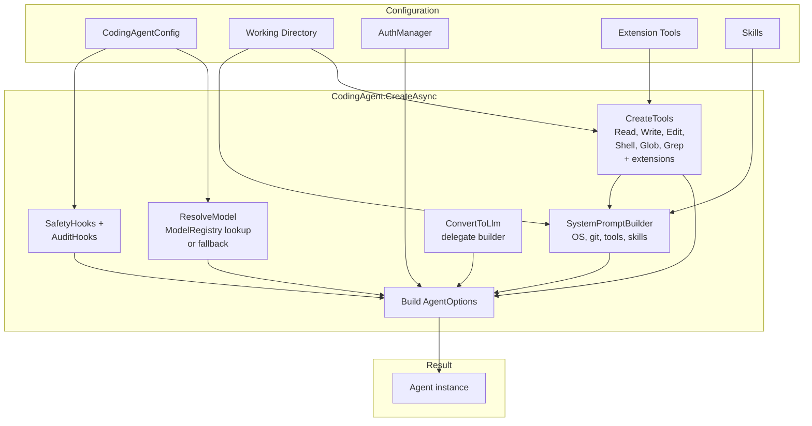

# CodingAgent Layer

The `CodingAgent` layer is where everything comes together. It builds on `AgentCore` to create a fully functional coding assistant with file operations, shell access, safety hooks, and an extension system. This document shows how the pieces connect.

## How CodingAgent Builds on AgentCore

`CodingAgent` is a static factory class. It doesn't subclass `Agent` — it configures and creates one:

```csharp
public static class CodingAgent
{
    public static async Task<Agent> CreateAsync(
        CodingAgentConfig config,
        string workingDirectory,
        AuthManager authManager,
        IReadOnlyList<IAgentTool>? extensionTools = null,
        IReadOnlyList<string>? skills = null);
}
```

Internally, `CreateAsync` does this:

1. **Resolves the working directory** and creates the `.botnexus-agent/` directory structure
2. **Creates built-in tools** scoped to the working directory
3. **Detects environment** — git branch, git status, package manager
4. **Builds the system prompt** via `SystemPromptBuilder`
5. **Resolves the model** from config or ModelRegistry
6. **Creates hooks** — `SafetyHooks` and `AuditHooks`
7. **Assembles `AgentOptions`** with all delegates wired up
8. **Returns a configured `Agent`**

## CodingAgent Composition



## Built-in Tools

The CodingAgent ships with six tools, all scoped to the working directory:

| Tool | Class | Purpose |
|------|-------|---------|
| `read` | `ReadTool` | Read file contents with optional line range |
| `write` | `WriteTool` | Create or overwrite files |
| `edit` | `EditTool` | Make targeted find-and-replace edits |
| `shell` | `ShellTool` | Execute shell commands |
| `glob` | `GlobTool` | Find files matching glob patterns |
| `grep` | `GrepTool` | Search file contents with regex |

Extension tools are appended after the built-in set:

```csharp
private static IReadOnlyList<IAgentTool> CreateTools(
    string workingDirectory, IReadOnlyList<IAgentTool>? extensionTools)
{
    var tools = new List<IAgentTool>
    {
        new ReadTool(workingDirectory),
        new WriteTool(workingDirectory),
        new EditTool(workingDirectory),
        new ShellTool(),
        new GlobTool(workingDirectory),
        new GrepTool(workingDirectory)
    };

    if (extensionTools is { Count: > 0 })
    {
        tools.AddRange(extensionTools);
    }

    return tools;
}
```

## System Prompt Construction

`SystemPromptBuilder` generates a context-aware system prompt:

```csharp
public sealed record SystemPromptContext(
    string WorkingDirectory,
    string? GitBranch,
    string? GitStatus,
    string PackageManager,
    IReadOnlyList<string> ToolNames,
    IReadOnlyList<string> Skills,
    string? CustomInstructions);
```

The generated prompt includes:
- Role definition ("You are a coding assistant with access to tools...")
- Environment section (OS, working directory, git branch, package manager, tools)
- Tool guidelines (use tools proactively, read before edit, verify changes)
- Skills section (if any skills are provided)
- Custom instructions (if configured)

## Configuration

`CodingAgentConfig` supports three-layer configuration merging:

```
Defaults → Global (~/.botnexus/coding-agent.json) → Local (.botnexus-agent/config.json)
```

```csharp
public sealed class CodingAgentConfig
{
    public string? Model { get; set; }            // e.g., "gpt-4.1"
    public string? Provider { get; set; }         // e.g., "github-copilot"
    public string? ApiKey { get; set; }           // Direct API key
    public int MaxToolIterations { get; set; }    // Default: 40
    public int MaxContextTokens { get; set; }     // Default: 100000
    public List<string> AllowedCommands { get; set; }  // Shell command whitelist
    public List<string> BlockedPaths { get; set; }     // File paths to deny
    public Dictionary<string, object?> Custom { get; set; }  // Extension config
}
```

The `Load(workingDirectory)` method handles the merge chain. `EnsureDirectories` creates the local config folder and writes a default `config.json` if missing.

## Safety Hooks

`SafetyHooks` runs as a `BeforeToolCallDelegate` and enforces:

- **Path blocking** — write/edit tools are checked against `BlockedPaths`
- **Command blocking** — shell commands are checked against `AllowedCommands` whitelist and a built-in blocklist (`rm -rf /`, `format`, `del /s /q`)
- **Large write warnings** — payloads over 1MB trigger a console warning

```csharp
public sealed class SafetyHooks
{
    public Task<BeforeToolCallResult?> ValidateAsync(
        BeforeToolCallContext context,
        CodingAgentConfig config);
}
```

## Session Management

The CodingAgent includes session support via `SessionManager`, `SessionInfo`, and `SessionCompactor`:

- Sessions track conversation history across runs
- The compactor manages context window limits by summarizing older messages
- Session data is stored in `.botnexus-agent/sessions/`

## Extension System

The `ExtensionLoader` and `SkillsLoader` provide dynamic capability loading:

### IExtension

```csharp
public interface IExtension
{
    string Name { get; }
    IReadOnlyList<IAgentTool> GetTools();
}
```

Extensions are loaded from assemblies in the `.botnexus-agent/extensions/` directory. Each extension can contribute additional tools.

### Skills

Skills are loaded from the `.botnexus-agent/skills/` directory and injected into the system prompt. They provide domain-specific instructions without requiring compiled code.

## Message Conversion

The `ConvertToLlm` delegate maps agent messages to provider messages:

```
UserMessage          → Providers.Core.Models.UserMessage (with optional image blocks)
AssistantAgentMessage → Providers.Core.Models.AssistantMessage (content + tool calls)
ToolResultAgentMessage → Providers.Core.Models.ToolResultMessage
```

The conversion handles:
- Multimodal content (text + images in user messages)
- Data URI parsing for image content
- Tool call content block mapping
- Usage metric conversion

## Model Resolution

The model is resolved from config with intelligent fallbacks:

```csharp
private static LlmModel ResolveModel(CodingAgentConfig config)
{
    var provider = config.Provider ?? "github-copilot";
    var modelId = config.Model ?? "gpt-4.1";

    // Normalize "copilot" → "github-copilot"
    if (provider.Equals("copilot", StringComparison.OrdinalIgnoreCase))
        provider = "github-copilot";

    // Try registry first
    var existing = ModelRegistry.GetModel(provider, modelId);
    if (existing is not null)
        return existing;

    // Fallback: construct a model definition
    return new LlmModel(
        Id: modelId,
        Name: modelId,
        Api: "openai-completions",
        Provider: provider,
        BaseUrl: "https://api.individual.githubcopilot.com",
        // ... defaults
    );
}
```

## Example: Creating a Minimal Coding Agent

```csharp
using BotNexus.AgentCore;
using BotNexus.CodingAgent;
using BotNexus.CodingAgent.Auth;

// Load config from working directory
var workingDir = Environment.CurrentDirectory;
var config = CodingAgentConfig.Load(workingDir);

// Create auth manager
var authManager = new AuthManager();

// Create the agent
var agent = await CodingAgent.CreateAsync(
    config,
    workingDir,
    authManager);

// Subscribe to streaming output
using var sub = agent.Subscribe(async (evt, ct) =>
{
    if (evt is MessageUpdateEvent update && update.ContentDelta is not null)
    {
        Console.Write(update.ContentDelta);
    }
});

// Run a prompt
var result = await agent.PromptAsync("Read the README and summarize what this project does.");

// Print the final response
if (result[^1] is AssistantAgentMessage final)
{
    Console.WriteLine(final.Content);
}
```

## Next Steps

- [Building Your Own →](06-building-your-own.md) — step-by-step guide to creating a custom agent
- [Tool Execution](04-tool-execution.md) — deep dive into tool mechanics
- [Architecture Overview](00-overview.md) — back to the big picture
