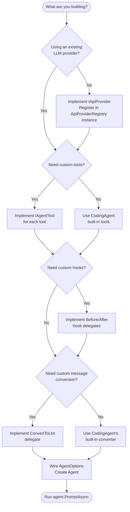

# Building Your Own Agent

This guide walks you through building a custom AI agent on top of BotNexus. By the end, you'll have a working agent with custom tools, provider configuration, and the full agent loop running.

## What Do You Need to Implement?

Use this decision tree to figure out what you need:



## Step 1: Choose Your Provider and Model

First, decide which LLM to use. BotNexus ships with three provider implementations plus a Copilot utility:

| Provider | Best For |
|----------|----------|
| GitHub Copilot | Default — uses OAuth, routed through OpenAI/Anthropic providers with `CopilotProvider` auth helpers |
| OpenAI | Direct OpenAI API access |
| Anthropic | Claude models |
| OpenAI-Compatible | Groq, xAI, local models, any OpenAI-compatible endpoint |

### Option A: Use a Built-in Provider

All registries are now instance-based. Create them, register providers, and wire into `LlmClient`:

```csharp
using BotNexus.Providers.Core;
using BotNexus.Providers.Core.Models;
using BotNexus.Providers.Core.Registry;

// Create instance-based registries
var apiProviderRegistry = new ApiProviderRegistry();
var modelRegistry = new ModelRegistry();

// Register providers (HttpClient is constructor-injected)
var httpClient = new HttpClient();
apiProviderRegistry.Register(new OpenAICompletionsProvider(httpClient, logger));
apiProviderRegistry.Register(new AnthropicProvider(httpClient));

// Create LlmClient with the registries
var llmClient = new LlmClient(apiProviderRegistry, modelRegistry);

// Look up a registered model
var model = modelRegistry.GetModel("github-copilot", "gpt-4.1");

// Or define one directly
var model = new LlmModel(
    Id: "gpt-4.1",
    Name: "GPT 4.1",
    Api: "openai-completions",      // Routes to OpenAICompletionsProvider
    Provider: "openai",
    BaseUrl: "https://api.openai.com/v1",
    Reasoning: false,
    Input: ["text"],
    Cost: new ModelCost(Input: 2.0m, Output: 8.0m, CacheRead: 0.5m, CacheWrite: 0),
    ContextWindow: 1_000_000,
    MaxTokens: 32768
);
```

### Option B: Register a Custom Provider

```csharp
public class MyProvider : IApiProvider
{
    public string Api => "my-api-format";

    public LlmStream Stream(LlmModel model, Context context, StreamOptions? options = null)
    {
        var stream = new LlmStream();

        // Start async work to call your API
        _ = Task.Run(async () =>
        {
            try
            {
                // Make HTTP request, parse response, push events
                stream.Push(new StartEvent(partialMessage));

                // For each chunk...
                stream.Push(new TextDeltaEvent(0, "Hello ", partialMessage));
                stream.Push(new TextDeltaEvent(0, "world!", partialMessage));

                stream.Push(new DoneEvent(StopReason.Stop, finalMessage));
                stream.End();
            }
            catch (Exception ex)
            {
                var error = CreateErrorMessage(ex);
                stream.Push(new ErrorEvent(StopReason.Error, error));
                stream.End();
            }
        });

        return stream;
    }

    public LlmStream StreamSimple(LlmModel model, Context context, SimpleStreamOptions? options = null)
    {
        return Stream(model, context, options);
    }
}

// Register it on the instance-based registry
apiProviderRegistry.Register(new MyProvider());
```

## Step 2: Define Custom Tools

Implement `IAgentTool` for each capability you want your agent to have.

```csharp
using System.Text.Json;
using BotNexus.AgentCore.Tools;
using BotNexus.AgentCore.Types;
using BotNexus.Providers.Core.Models;

public sealed class WeatherTool : IAgentTool
{
    public string Name => "get_weather";
    public string Label => "Get Weather";

    public Tool Definition => new Tool(
        Name: "get_weather",
        Description: "Get current weather for a location.",
        Parameters: JsonSerializer.Deserialize<JsonElement>("""
        {
            "type": "object",
            "properties": {
                "location": {
                    "type": "string",
                    "description": "City name or coordinates"
                }
            },
            "required": ["location"]
        }
        """));

    public Task<IReadOnlyDictionary<string, object?>> PrepareArgumentsAsync(
        IReadOnlyDictionary<string, object?> arguments,
        CancellationToken cancellationToken = default)
    {
        if (!arguments.ContainsKey("location"))
            throw new ArgumentException("'location' is required.");
        return Task.FromResult(arguments);
    }

    public async Task<AgentToolResult> ExecuteAsync(
        string toolCallId,
        IReadOnlyDictionary<string, object?> arguments,
        CancellationToken cancellationToken = default,
        AgentToolUpdateCallback? onUpdate = null)
    {
        var location = arguments["location"]!.ToString()!;
        var weather = await FetchWeatherAsync(location, cancellationToken);

        return new AgentToolResult([
            new AgentToolContent(AgentToolContentType.Text, weather)
        ]);
    }

    private static async Task<string> FetchWeatherAsync(string location, CancellationToken ct)
    {
        // Your API call here
        return $"Weather in {location}: 72°F, sunny";
    }
}
```

## Step 3: Wire AgentOptions

Now assemble everything into `AgentOptions`. Note that `LlmClient` is now a required parameter:

```csharp
using BotNexus.AgentCore;
using BotNexus.AgentCore.Configuration;
using BotNexus.AgentCore.Types;
using BotNexus.Providers.Core;
using BotNexus.Providers.Core.Models;
using BotNexus.Providers.Core.Registry;

// Your tools
var tools = new List<IAgentTool>
{
    new WeatherTool(),
    // Add more tools...
};

// System prompt
var systemPrompt = """
    You are a helpful weather assistant.
    Use the get_weather tool to answer weather questions.
    Always provide temperature and conditions.
    """;

// Model
var model = new LlmModel(
    Id: "gpt-4.1",
    Name: "GPT 4.1",
    Api: "openai-completions",
    Provider: "openai",
    BaseUrl: "https://api.openai.com/v1",
    Reasoning: false,
    Input: ["text"],
    Cost: new ModelCost(2.0m, 8.0m, 0.5m, 0),
    ContextWindow: 1_000_000,
    MaxTokens: 32768
);

// ConvertToLlm — maps AgentMessage to provider Message
ConvertToLlmDelegate convertToLlm = (messages, ct) =>
{
    var result = messages
        .Where(m => m.Role is "user" or "assistant" or "tool")
        .Select<AgentMessage, Message>(m => m switch
        {
            UserMessage user => new BotNexus.Providers.Core.Models.UserMessage(
                new UserMessageContent(user.Content),
                DateTimeOffset.UtcNow.ToUnixTimeMilliseconds()),

            AssistantAgentMessage assistant => new AssistantMessage(
                Content: BuildContentBlocks(assistant),
                Api: model.Api,
                Provider: model.Provider,
                ModelId: model.Id,
                Usage: Usage.Empty(),
                StopReason: assistant.FinishReason,
                ErrorMessage: assistant.ErrorMessage,
                ResponseId: null,
                Timestamp: DateTimeOffset.UtcNow.ToUnixTimeMilliseconds()),

            ToolResultAgentMessage toolResult => new ToolResultMessage(
                ToolCallId: toolResult.ToolCallId,
                ToolName: toolResult.ToolName,
                Content: toolResult.Result.Content
                    .Select(c => (ContentBlock)new TextContent(c.Value))
                    .ToList(),
                IsError: toolResult.IsError,
                Timestamp: DateTimeOffset.UtcNow.ToUnixTimeMilliseconds()),

            _ => throw new InvalidOperationException($"Unknown message type: {m.GetType().Name}")
        })
        .ToList();

    return Task.FromResult<IReadOnlyList<Message>>(result);
};

// Create instance-based registries and client
var apiProviderRegistry = new ApiProviderRegistry();
var modelRegistry = new ModelRegistry();
var httpClient = new HttpClient();
apiProviderRegistry.Register(new OpenAICompletionsProvider(httpClient, logger));
var llmClient = new LlmClient(apiProviderRegistry, modelRegistry);

// Build agent options
var options = new AgentOptions(
    InitialState: new AgentInitialState(
        SystemPrompt: systemPrompt,
        Model: model,
        Tools: tools),
    Model: model,
    LlmClient: llmClient,
    ConvertToLlm: convertToLlm,
    TransformContext: (messages, ct) => Task.FromResult(messages),
    GetApiKey: (provider, ct) =>
        Task.FromResult(EnvironmentApiKeys.GetApiKey(provider)),
    GetSteeringMessages: null,
    GetFollowUpMessages: null,
    ToolExecutionMode: ToolExecutionMode.Sequential,
    BeforeToolCall: null,
    AfterToolCall: null,
    GenerationSettings: new SimpleStreamOptions
    {
        MaxTokens = model.MaxTokens
    },
    SteeringMode: QueueMode.All,
    FollowUpMode: QueueMode.All);

// Helper to build content blocks
static List<ContentBlock> BuildContentBlocks(AssistantAgentMessage assistant)
{
    var blocks = new List<ContentBlock>();
    if (!string.IsNullOrEmpty(assistant.Content))
        blocks.Add(new TextContent(assistant.Content));
    if (assistant.ToolCalls is { Count: > 0 })
        blocks.AddRange(assistant.ToolCalls);
    return blocks;
}
```

## Step 4: Create and Run

```csharp
// Create the agent
var agent = new Agent(options);

// Subscribe to streaming output
using var sub = agent.Subscribe(async (evt, ct) =>
{
    switch (evt)
    {
        case MessageUpdateEvent { ContentDelta: not null } update:
            Console.Write(update.ContentDelta);
            break;
        case ToolExecutionStartEvent toolStart:
            Console.WriteLine($"\n[calling {toolStart.ToolName}...]");
            break;
        case ToolExecutionEndEvent toolEnd:
            Console.WriteLine($"[{toolEnd.ToolName} done]");
            break;
    }
});

// Run a conversation
var result = await agent.PromptAsync("What's the weather in Seattle?");

// Continue the conversation
var followUp = await agent.PromptAsync("How about Tokyo?");
```

## Configuration Options

### Adding Before/After Hooks

```csharp
// Block certain tools
BeforeToolCallDelegate beforeHook = (context, ct) =>
{
    if (context.ToolCallRequest.Name == "dangerous_tool")
    {
        return Task.FromResult<BeforeToolCallResult?>(
            new BeforeToolCallResult(Block: true, Reason: "This tool is disabled."));
    }
    return Task.FromResult<BeforeToolCallResult?>(null);
};

// Log all tool results
AfterToolCallDelegate afterHook = (context, ct) =>
{
    Console.WriteLine($"Tool {context.ToolCallRequest.Name} returned {(context.IsError ? "error" : "success")}");
    return Task.FromResult<AfterToolCallResult?>(null);
};
```

### Parallel Tool Execution

```csharp
// Enable parallel execution for independent tools
ToolExecutionMode: ToolExecutionMode.Parallel,
```

### Steering (Mid-Run Injection)

```csharp
// Inject a correction while the agent is running
agent.Steer(new UserMessage("Use Fahrenheit, not Celsius"));
```

### Context Transformation

```csharp
// Limit context window by keeping only recent messages
TransformContext: (messages, ct) =>
{
    if (messages.Count > 50)
    {
        var recent = messages.Skip(messages.Count - 50).ToList();
        return Task.FromResult<IReadOnlyList<AgentMessage>>(recent);
    }
    return Task.FromResult(messages);
},
```

## Complete Working Example

Here's a self-contained agent that answers questions using a calculator tool:

```csharp
using BotNexus.AgentCore;
using BotNexus.AgentCore.Configuration;
using BotNexus.AgentCore.Tools;
using BotNexus.AgentCore.Types;
using BotNexus.Providers.Core;
using BotNexus.Providers.Core.Models;
using BotNexus.Providers.Core.Registry;

// --- Define tool ---
var calcTool = new CalculatorTool();

// --- Define model ---
var model = new LlmModel(
    Id: "gpt-4.1", Name: "GPT 4.1",
    Api: "openai-completions", Provider: "openai",
    BaseUrl: "https://api.openai.com/v1",
    Reasoning: false, Input: ["text"],
    Cost: new ModelCost(2.0m, 8.0m, 0.5m, 0),
    ContextWindow: 1_000_000, MaxTokens: 32768);

// --- Create instance-based registries and client ---
var apiProviderRegistry = new ApiProviderRegistry();
var modelRegistry = new ModelRegistry();
var httpClient = new HttpClient();
apiProviderRegistry.Register(new OpenAICompletionsProvider(httpClient, logger));
var llmClient = new LlmClient(apiProviderRegistry, modelRegistry);

// --- Build agent ---
var agent = new Agent(new AgentOptions(
    InitialState: new AgentInitialState(
        SystemPrompt: "You are a math assistant. Use the calculator tool for arithmetic.",
        Model: model,
        Tools: [calcTool]),
    Model: model,
    LlmClient: llmClient,
    ConvertToLlm: MyConvertToLlm,
    TransformContext: (msgs, ct) => Task.FromResult(msgs),
    GetApiKey: (provider, ct) => Task.FromResult(EnvironmentApiKeys.GetApiKey(provider)),
    GetSteeringMessages: null,
    GetFollowUpMessages: null,
    ToolExecutionMode: ToolExecutionMode.Sequential,
    BeforeToolCall: null,
    AfterToolCall: null,
    GenerationSettings: new SimpleStreamOptions { MaxTokens = 4096 },
    SteeringMode: QueueMode.All,
    FollowUpMode: QueueMode.All));

// --- Stream output ---
using var sub = agent.Subscribe(async (evt, ct) =>
{
    if (evt is MessageUpdateEvent { ContentDelta: not null } u)
        Console.Write(u.ContentDelta);
});

// --- Run ---
Console.WriteLine("You: What is 42 * 37?");
var result = await agent.PromptAsync("What is 42 * 37?");
Console.WriteLine();
```

## Summary

To build your own agent on BotNexus:

1. **Create registries** — instantiate `ApiProviderRegistry`, `ModelRegistry`, and `LlmClient`
2. **Pick a provider** — use a built-in one (with `HttpClient` injection) or implement `IApiProvider`
3. **Define your tools** — implement `IAgentTool` for each capability
4. **Write a system prompt** — tell the model what it is and what tools it has
5. **Implement `ConvertToLlm`** — map `AgentMessage` types to provider `Message` types
6. **Assemble `AgentOptions`** — wire everything together (including `LlmClient` instance)
7. **Create an `Agent`** and call `PromptAsync`

The agent loop handles everything else: streaming, tool execution, error handling, and turn management.

## Next Steps

- [Tool Execution](04-tool-execution.md) — deep dive into custom tool implementation
- [Agent Loop](03-agent-loop.md) — understand the orchestration loop
- [Provider System](01-provider-system.md) — implement a custom provider
- [Architecture Overview](00-overview.md) — back to the big picture
